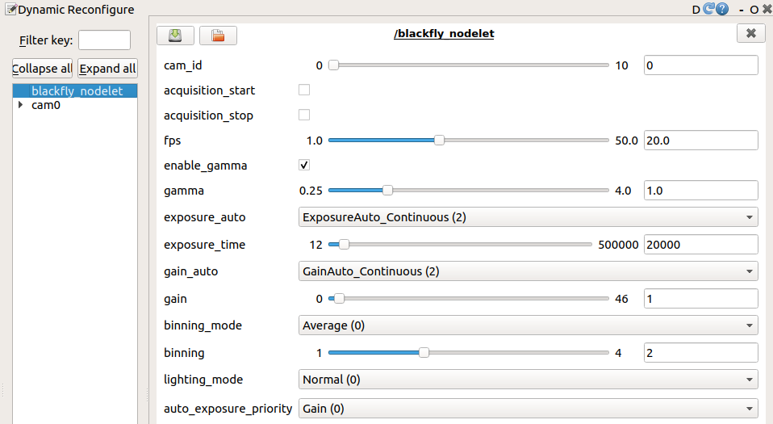

# blackfly_nodelet

Simple ROS driver wrapping the Spinnaker API for Blackfly Cameras.

## Setup

### Spinnaker

1. Download the [Spinnaker SDK from FLIR](https://www.flir.eu/products/spinnaker-sdk/) as per your distribution and architecture (Note: this driver has only been tested on Linux variants)
2. Unzip it and go through the README for installation instructions for your system
3. If Spinnaker is installed in a custom location, you will need to include the path to it in the [FindSpinnaker.cmake](cmake/FindSpinnaker.cmake)

#### Notes

1. This branch is only compatible with Spinnaker 2.x as noted in the table below. Switch to the `spinnaker1` branch for Spinnaker 1.x.
   * Ubuntu 20.04:
      | Version   | amd64                       |
      | :-------- | :-------------------------- |
      | 2.5.0.80  | Y                           |
      | 2.4.0.143 | Y                           |
      | 2.0.0.109 | N - Use `spinnaker1` branch |
2. The machine may need to be rebooted after installing spinnaker
3. Make sure to accept the increase in the usb-fs memory - if this is a small value, the camera may only work at a low frame rate

### blackfly_nodelet

```bash
mkdir -p catkin_ws/src
git clone git@github.com:ntnu-arl/blackfly_nodelet.git
cd ..
catkin config -DCMAKE_BUILD_TYPE=Release
catkin build blackfly
source devel/setup.bash
```

## Usage

Edit the `camera_serial_nums` param in the `launch/1_camera.launch` launchfile and run:

```bash
source devel/setup.bash
roslaunch blackfly 1_camera.launch
```

The image will be published on the topics created according to the `camera_names` parameter.

Check the `launch/2_cameras.launch` launchfile for an example of running multiple cameras.

### Notes

1. Camera Frame rate may drop if the camera is not connected to a USB3.0 port.
2. If using auto exposure, auto gain, and gamma correction, the camera tends to choose the maximum exposure value.
3. If the framerate is lower than expected, check the usb-fs memory size using

  ```bash
  cat /sys/module/usbcore/parameters/usbfs_memory_mb
  ```

  If this value is < 1024, set it >= 1024 by changing `/etc/default/grub` from

  ```bash
  GRUB_CMDLINE_LINUX_DEFAULT="quiet splash"
  ```

  to

  ```bash
  GRUB_CMDLINE_LINUX_DEFAULT="quiet splash usbcore.usbfs_memory_mb=32768"
  ```

  and then run

  ```bash
  sudo update-grub
  ```

  and finally restart the system and check that the value has been set correctly using

  ```bash
  cat /sys/module/usbcore/parameters/usbfs_memory_mb
  ```

4. It is recommended to use a 330 Ohm or lower value resistor to connect the OptoIn to the trigger signal.

## Timestamping

Images are timestamped using the End of Exposure event given by the Spinnaker API. When this event occurs, the current ROS time is saved in the device event handler class. The device event handler then queries the camera for its current exposure time. The exposure time is divided by 2, and this time is subtracted from the saved time stamp. This procedure is performed in order to move the image's timestamp to the middle of the camera's exposure.

## Dynamic Reconfigure

Set `enable_dyn_reconf` param in the launch file to `true` to change the following parameters online:



You can open an issue or contact us for any questions:

* [Nikhil Khedekar](mailto:nikhil.v.khedekar@ntnu.no)
* [Paolo De Petris](mailto:paolo.de.petris@ntnu.no)
* [Frank Mascarich](mailto:fmascarich@nevada.unr.edu)
* [Kostas Alexis](mailto:konstantinos.alexis@ntnu.no)
